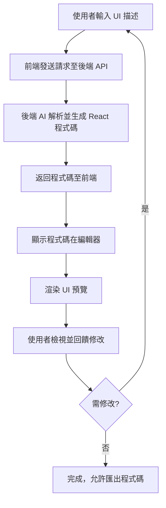

# UI Prototyping Chatbot

## 專案概述

此專案旨在建立一個基於 React 和 TypeScript 的前端應用，讓使用者透過聊天機器人 (Chatbot) 互動，即可根據自然語言描述生成 UI 組件。應用聚焦於前端實現，假定後端代理 (Backend Agent) 負責 AI 邏輯處理，前端僅定義與後端的介面。生成的 UI 將以 React 組件程式碼形式呈現，並提供即時預覽功能，支援迭代修改。

目標是快速原型開發工具，幫助開發者或設計師透過對話方式產生可重用的 UI 程式碼。

## 核心功能

1. **聊天介面**：使用者輸入自然語言描述 UI 需求，例如「建立一個包含使用者名稱和密碼的登入表單，包含提交按鈕」。
2. **AI 驅動生成**：Chatbot 解析輸入，透過後端代理生成對應的 React 組件 TypeScript 程式碼。
3. **程式碼顯示**：呈現生成的完整 React 組件程式碼，使用程式碼編輯器讓使用者檢視和複製。
4. **UI 預覽**：在聊天介面旁渲染生成的 UI 組件，提供即時視覺反饋。
5. **迭代互動**：使用者可回饋修改需求（如「將按鈕改為藍色」），Chatbot 基於先前上下文更新程式碼和預覽。

## 技術堆疊

- **前端框架**：React (v18+) + TypeScript
- **聊天介面**：使用 custom React hooks 實現互動式對話
- **程式碼顯示**：react-codemirror2 呈現高亮程式碼
- **UI 預覽**：使用 react-live 安全渲染組件
- **樣式**：Tailwind CSS 美化介面
- **建置工具**：Vite (快速開發伺服器和打包)
- **狀態管理**：React Context 管理聊天歷史和生成狀態
- **後端整合**：僅定義 RESTful API 介面，呼叫後端代理處理 AI 生成 (無直接 AI API 暴露)

## 系統架構

應用分為前端和假定後端兩部分：

- **前端**：處理使用者輸入、顯示聊天、程式碼和預覽。透過 API 與後端通訊。
- **後端代理** (假定)：接收 UI 描述，整合 AI (如 OpenAI GPT-4) 生成 React 程式碼，返回 JSON 格式結果。

### API 介面定義

前端與後端的通訊使用 POST /generate-ui 端點。

**請求格式 (JSON)**：
```json
{
  "prompt": "string",  // 使用者輸入的 UI 描述
  "context": "string", // 可選，先前對話上下文 (用於迭代)
  "framework": "react" // 固定為 React
}
```

**回應格式 (JSON)**：
```json
{
  "success": boolean,
  "code": "string",    // 生成的 React 組件 TypeScript 程式碼
  "previewProps": {    // 可選，用於預覽的 props
    "componentName": "string"
  },
  "error": "string"    // 若失敗，錯誤訊息
}
```

錯誤處理：若 API 失敗，顯示友好錯誤訊息並允許重試。

## 使用者互動流程

以下 Mermaid 圖描述主要流程：



## 開發與部署

1. **環境設定**：安裝 Node.js v18+，使用 `npm install` 安裝依賴。
2. **執行開發伺服器**：`npm run dev` (Vite)。
3. **建置生產版本**：`npm run build`。
4. **部署**：可部署至 Vercel 或 Netlify (前端靜態)，後端需獨立部署。

## 未來擴展

- 支援多框架 (Vue, HTML/CSS)。
- 整合更多 AI 模型 (如 Grok)。
- 添加 UI 組件庫整合 (Material-UI, Ant Design)。
- 持久化聊天歷史 (localStorage 或後端資料庫)。

此規格基於討論的核心功能和技術選擇。若需調整，請提供反饋。
