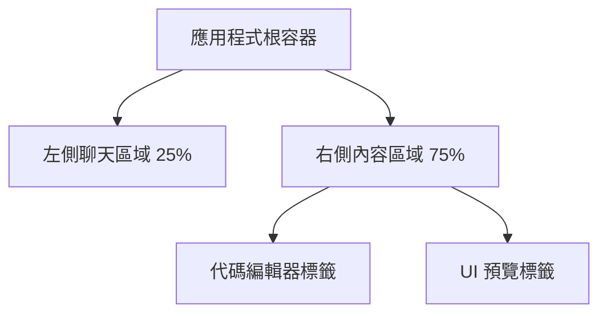
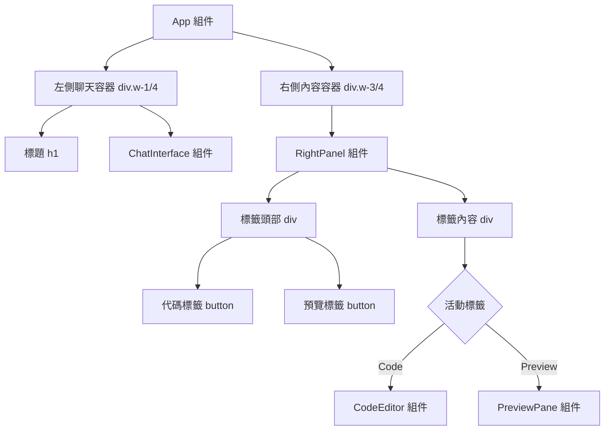

# UI Prototyping Chatbot 設計框架

## 整體系統架構圖

使用 Mermaid 流程圖描述系統架構，強調前端與後端代理的互動，以及內部組件流程。

```mermaid
graph TB
    subgraph "前端 (React + TypeScript)"
        UI[使用者介面]
        Chat[聊天介面組件]
        Code[程式碼顯示組件]
        Preview[UI 預覽組件]
        State[狀態管理 (React Context)]
        API[API 呼叫層]
    end
    subgraph "後端代理 (假定)"
        AI[AI 處理 (e.g., GPT-4)]
        Gen[程式碼生成]
    end
    UI --> Chat
    Chat --> State
    State --> API
    API <--> |POST /generate-ui| AI
    AI --> Gen
    Gen --> API
    API --> State
    State --> Code
    State --> Preview
    Preview --> |渲染 react-live| UI
    Code --> |react-codemirror2| UI
    Chat --> |迭代輸入| UI
```

此圖顯示使用者輸入經聊天介面處理，狀態管理協調 API 呼叫至後端生成程式碼，然後更新程式碼顯示與 UI 預覽。

## React 組件結構

專案採用模組化組件結構，頂層為 `App` 組件，負責整體佈局與狀態初始化。子組件聚焦特定功能，支援重用與測試。

- **頂層組件**：
  - `App.tsx`：根組件，包含路由（若需）、主題設定 (Tailwind CSS)、全域錯誤邊界，以及主要容器 (聊天區、程式碼區、預覽區)。使用 `React.StrictMode` 包裝。

- **聊天介面組件**：
  - `ChatInterface.tsx`：處理使用者輸入、顯示聊天歷史。包含輸入框、發送按鈕、訊息泡泡 (bot vs user)。
  - `MessageBubble.tsx`：單一訊息渲染組件，支援 Markdown 渲染 (若 bot 回應需)。

- **程式碼顯示組件**：
  - `CodeEditor.tsx`：使用 `react-codemirror2` 顯示生成的 TypeScript 程式碼。支援語法高亮、唯讀模式、複製按鈕。
  - `CodeActions.tsx`：工具列，提供匯出 (下載檔案)、重置功能。

- **UI 預覽組件**：
  - `PreviewPane.tsx`：使用 `react-live` 安全渲染生成的 React 組件。包含載入狀態、錯誤顯示。
  - `LiveRenderer.tsx`：核心渲染器，動態 import 生成的組件程式碼並執行。

- **輔助組件**：
  - `ErrorBoundary.tsx`：捕捉渲染錯誤，顯示友好訊息。
  - `LoadingSpinner.tsx`：通用載入指示器。
  - `Header.tsx`：應用標題與說明。

組件層級：`App` → 並排佈局 (`ChatInterface` | `CodeEditor` + `PreviewPane`)。

## 資料流程

### 狀態管理
使用 React Context 管理全域狀態，避免 props drilling。建立 `ChatContext` 與 `GenerationContext`。

- **ChatContext**：
  - 狀態：`messages: Message[]` (聊天歷史，Message = { role: 'user'|'bot', content: string, timestamp: Date })、`isLoading: boolean`。
  - 更新：使用者輸入時 append 新訊息，API 回應時 append bot 訊息。

- **GenerationContext**：
  - 狀態：`generatedCode: string`、`previewProps: { componentName: string }`、`error: string | null`。
  - 更新：API 成功時設定 code 與 props，失敗時設定 error。

狀態初始化於 `App` 組件，使用 `useReducer` 處理複雜更新 (e.g., 迭代上下文累積)。

### API 呼叫
使用 `fetch` 或 Axios (依賴安裝) 於自訂 hook `useGenerateUI` 中處理。

- 流程：
  1. 使用者提交輸入 → `ChatInterface` 呼叫 `useGenerateUI(prompt, context)`。
  2. Hook 發送 POST `/generate-ui` (請求如 README 定義)。
  3. 等待回應 → 更新 GenerationContext。
  4. 成功：觸發 `CodeEditor` 與 `PreviewPane` re-render。
  5. 迭代：context 為先前 messages 序列化 (JSON.stringify)。

- 錯誤處理：
  - 網路錯誤：顯示 Toast 通知 (使用 react-hot-toast，若安裝)，重試按鈕。
  - API 錯誤：解析 `response.error`，顯示於聊天 (bot 訊息) 或專用錯誤面板。記錄至 console (開發模式)。
  - 預覽錯誤：`react-live` 捕捉，顯示於 `PreviewPane` (e.g., 語法錯誤高亮)。

資料流單向：輸入 → 狀態 → API → 狀態 → 渲染。使用 `useEffect` 監聽狀態變化觸發渲染。

## 關鍵介面定義

### Props
- `ChatInterfaceProps`：`{ onSubmit: (prompt: string) => void, messages: Message[] }` – 傳遞提交處理與歷史。
- `CodeEditorProps`：`{ code: string, language: 'typescript', readOnly: true, onCopy: () => void }` – 程式碼內容與動作。
- `PreviewPaneProps`：`{ code: string, props: PreviewProps, onError: (err: string) => void }` – 渲染資料與錯誤回調。
- `MessageBubbleProps`：`{ message: Message, isUser: boolean }` – 訊息細節與樣式旗標。

### State
- 全域 (Context)：如上所述，`messages`、`generatedCode`、`isLoading`、`error`。
- 本地 (hooks)：`useState` 於輸入框 (`inputValue: string`)，`useRef` 於滾動 (聊天容器)。

### Hooks
- `useChat`：自訂 hook，返回 `{ messages, sendMessage, isLoading }`。整合 Context 與 API。
- `useGenerateUI`：`const [generate, { data, loading, error }] = useGenerateUI();` – 類似 React Query，處理快取與重試。
- `useLivePreview`：整合 `react-live`，返回 `{ component, error }` 基於 code 動態編譯。
- `useContext`：存取 ChatContext 與 GenerationContext。

介面使用 TypeScript 嚴格定義，確保類型安全 (e.g., `interface Message { ... }`)。

## 目錄結構建議

基於 Vite + React 預設，擴展為模組化結構。現有 src/ 為起點，建議如下：

```
prototyper-frontend/
├── public/                 # 靜態資產 (現有)
├── src/
│   ├── components/         # 所有 React 組件
│   │   ├── Chat/           # 聊天相關
│   │   │   ├── ChatInterface.tsx
│   │   │   └── MessageBubble.tsx
│   │   ├── Code/           # 程式碼顯示
│   │   │   ├── CodeEditor.tsx
│   │   │   └── CodeActions.tsx
│   │   ├── Preview/        # UI 預覽
│   │   │   ├── PreviewPane.tsx
│   │   │   └── LiveRenderer.tsx
│   │   ├── common/         # 輔助組件
│   │   │   ├── ErrorBoundary.tsx
│   │   │   └── LoadingSpinner.tsx
│   │   └── Header.tsx
│   ├── contexts/           # 狀態管理
│   │   ├── ChatContext.tsx
│   │   └── GenerationContext.tsx
│   ├── hooks/              # 自訂 hooks
│   │   ├── useChat.ts
│   │   ├── useGenerateUI.ts
│   │   └── useLivePreview.ts
│   ├── services/           # API 與工具
│   │   └── api.ts          # fetch 函式
│   ├── types/              # TypeScript 介面
│   │   ├── index.ts        # Message, PreviewProps 等
│   │   └── api.ts          # 請求/回應類型
│   ├── utils/              # 輔助函式
│   │   └── constants.ts    # API 端點等
│   ├── App.tsx             # 頂層 (現有，擴展)
│   ├── main.tsx            # 入口 (現有)
│   └── index.css           # 全域樣式 (Tailwind)
├── package.json            # 依賴 (新增 react-codemirror2, react-live, @types 等)
├── tsconfig.json           # TypeScript 配置 (現有)
├── vite.config.ts          # Vite 配置 (若需代理 API)
└── README.md               # 專案文件 (現有)
```

此結構促進可擴展性，components/ 分類功能，types/ 集中介面定義。Tailwind 配置於 `tailwind.config.js` (新增)。

此設計框架確保模組化、類型安全與使用者體驗流暢，符合 README 規格。

## 佈局規格 (Layout Specification)

### 整體佈局結構
應用程式採用經典的三欄式佈局設計，主要分為三個功能區域：

1. **左側聊天區域 (25% 寬度)**：專門用於使用者與 AI 助手的對話互動
2. **右側內容區域 (75% 寬度)**：包含代碼編輯器和預覽面板的標籤式界面
3. **頂部標題區域**：應用程式標題和基本資訊



### 詳細佈局組件

- **主容器 (`App.tsx`)**：
  - 使用 Flexbox 進行水平佈局
  - 設定最小高度為視窗高度
  - 背景顏色為淺灰色 (`bg-gray-100`)

- **左側聊天區域**：
  - 寬度佔總寬度的 1/4 (`w-1/4`)
  - 右邊框分隔線 (`border-r`)
  - 背景為白色 (`bg-white`)
  - 內邊距為 16px (`p-4`)
  - 包含應用標題和 `ChatInterface` 組件

- **右側內容區域**：
  - 寬度佔總寬度的 3/4 (`w-3/4`)
  - 包含標籤式界面 (`RightPanel`)，可切換代碼和預覽視圖

- **標籤面板 (`RightPanel.tsx`)**：
  - 使用狀態管理 (`useState`) 控制活動標籤
  - 標籤頭部：水平排列的按鈕 (`Code` 和 `Preview`)
  - 標籤內容：根據活動標籤顯示對應組件

### 響應式設計策略

應用程式使用 Tailwind CSS 實現響應式設計，確保在不同螢幕尺寸下都能提供良好的使用者體驗：

- **斷點策略**：
  - 預設使用移動優先的方法
  - 在較大螢幕上調整佈局以提高效率

- **行動裝置適應**：
  - 在小螢幕上可能需要調整為垂直佈局
  - 聊天區域和內容區域可改為上下排列
  - 標籤面板在小螢幕上保持功能完整

- **具體實現**：
  - 使用 Tailwind 的內建斷點類別 (`sm:`, `md:`, `lg:`, `xl:`, `2xl:`)
  - 在必要時添加自定義媒體查詢

### 佈局組件層級結構



### 佈局樣式和主題

- **顏色主題**：
  - 主背景：`bg-gray-100` (淺灰色)
  - 組件背景：`bg-white` (白色)
  - 主要顏色：藍色系用於活動狀態和互動元素

- **間距和邊框**：
  - 使用一致的內邊距和外邊距 (`p-4`, `m-4` 等)
  - 分隔線用於區分不同功能區域
  - 圓角設計 (`rounded-md`, `rounded-lg`) 提升視覺效果

- **陰影效果**：
  - 容器使用輕微陰影 (`shadow-lg`, `shadow-md`) 增加層次感
  - 按鈕和互動元素在懸停時有視覺反饋

此佈局設計確保應用程式在桌面環境下提供高效的工作流程，同時保持良好的視覺層次和使用者體驗。